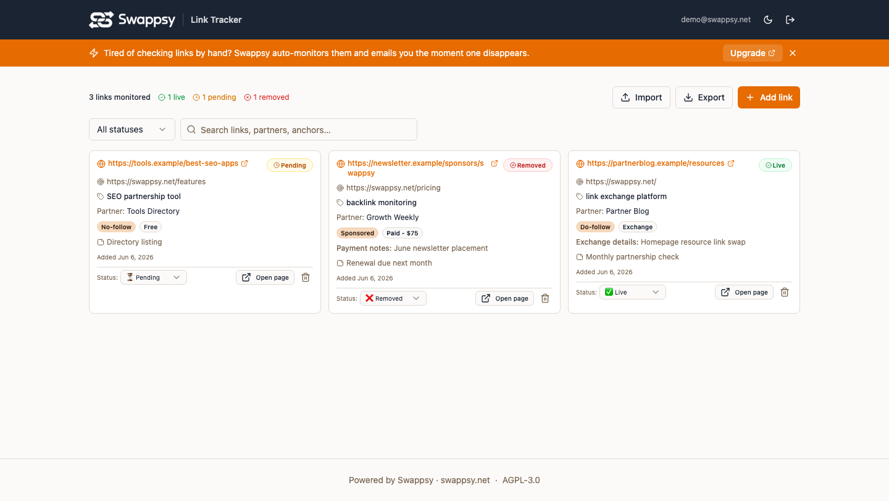

# 🔗 Swappsy Link Tracker

A tiny, self-hostable tool to **track the links you exchange** — keep a list of where your links were
placed, who you exchanged with, and whether each one is still **live**, **pending**, or **removed**.

Free and open source (AGPL-3.0).

> **Want this on autopilot?** This tool checks links **manually** — you click "Open page", eyeball the
> page, and set the status yourself. The hosted version at **[swappsy.net](https://swappsy.net)**
> *automatically* monitors every link on a schedule and **emails you the moment one disappears**, plus
> full check history and a link-exchange marketplace. → [Upgrade to Swappsy](https://swappsy.net)

---

## Screenshots



## Features

- Add / edit / delete tracked links — placement URL, target URL, anchor text, partner, link type, deal type, notes
- Track SEO/commercial metadata — do-follow / no-follow / sponsored, free / exchange / paid
- Manual status: **pending → live → removed**
- Status summary + filter + search
- CSV import & export
- Light / dark mode
- Single-file SQLite database — no external services to run

## Quick start (local)

```bash
git clone https://github.com/swappsy/swappsy-link-tracker
cd swappsy-link-tracker
cp .env.example .env        # set ADMIN_EMAIL, ADMIN_PASSWORD, JWT_SECRET
npm install                 # installs client + server
npm run dev                 # client on :5173, api on :4000
```

## Run with Docker

```bash
cp .env.example .env
docker compose up --build   # serves the built app on http://localhost:4000
```

The SQLite database persists in the `./data` volume.

## Configuration (`.env`)

| Variable | Default | Description |
|---|---|---|
| `PORT` | `4000` | Server port (also serves the built client in production) |
| `DB_PATH` | `./data/tracker.db` | SQLite file location |
| `JWT_SECRET` | — | **Required.** Secret for signing login tokens |
| `ADMIN_EMAIL` | — | The single-user account email |
| `ADMIN_PASSWORD` | — | The single-user account password (hashed on first boot) |

## Requirements

Node.js **22 or newer** (uses the built-in `node:sqlite` — no native build step).

## Tech

React + Vite + TypeScript + Tailwind + shadcn/ui · Express + `node:sqlite` (single file, zero-config).

## License

[AGPL-3.0](LICENSE). "Swappsy" and the Swappsy logo are trademarks and are **not** covered by this
license. See [CONTRIBUTING.md](CONTRIBUTING.md) for the contributor agreement.

---

*Powered by [Swappsy](https://swappsy.net) — the backlink exchange platform for real partnerships.*
